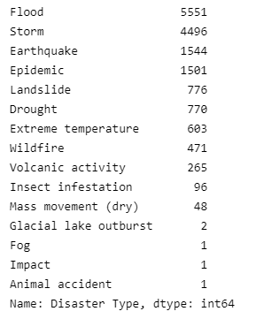
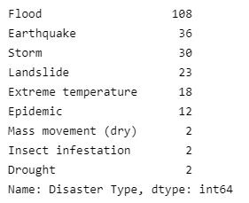
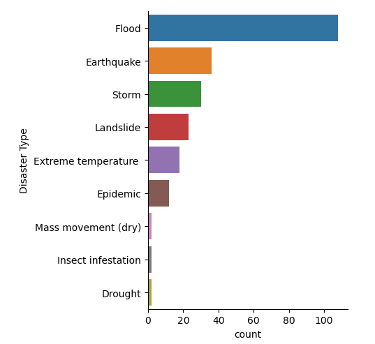

## Global natural disaster data analysis with machine learning
In this tutorial, we will perform some data analysis on our dataset to gain insights. 

### Essential Libaries!

Firstly, let us import the following libaries into our jupyer notebook:
- Pandas: Library for Data Manipulation and Analysis in Python 
- NumPy: Libarary for Scientific Computation in Python
- Seaborn/Matplotlib: Library for Data Visualisation in Python

```
# Basic Libaries
import pandas as pd 
import numpy as np
import seaborn as sb 
import matplotlib as plt 
```

### Import CSV file
Next, we will import CSV files which contains the data that we are interested in. In general, there are 5 ways to import the data in pandas:
1. read_csv: dataset is in .csv format
2. read_table: dataset is in .txt format
3. read_excel: dataset is in .xls or .xlsx format
4. read_json: dataset is in json format
5. read_html: dataset is in table format within an HTML webpage 

In this tutorial, we will use the natural disaster dataset that can be found via Kaggle:
1. [Natural Disaster data from 1900 to 2021](https://www.kaggle.com/code/gianlab/storm-and-flood-forecast/data)

As both of the datasets are in .csv format, we will use **read_csv** and store the data as dataframe into **disaster_data** and **rainfall_data** variables.

```
disaster_data = pd.read_csv('1900_2021_DISASTERS.xlsx - emdat data.csv') 
rainfall_data = pd.read_csv('Rainfall_1901_2016_PAK.csv') 
```
To show a preview of the dataframe, we can use the **.head()** to show the first 5 rows of the dataframe.
```
disaster_data.head()
```


### Data Analysis
Next, we can perform **Data Exploration** to analyse the dataset to learn more about it. 

Firstly, let us check the occurence for each type of disaster and visualise it using seaborn.
```
# To print the value of each disaster type
print(disaster_data['Disaster Type'].value_counts())

# visualise the occurence using seaborn 
plot_order = disaster_data['Disaster Type'].value_counts().index
sb.catplot(y = "Disaster Type", data = disaster_data, kind = "count", order=plot_order)
```



Based on the visualisation, we can see that flood is the most frequently occurred natural disasters around the world. 

As we are concern with Pakistan, let us filter the dataframe to **Pakistan** and check the occurence for each type of disaster and visualise it using seaborn.
```
# Filter the data to Pakistan 
disaster_data_pakistan = disaster_data[(disaster_data['Country'] == 'Pakistan').reset_index(drop=True)]

# To print the value of each disaster type
print(disaster_data_pakistan['Disaster Type'].value_counts())

# visualise the occurence using seaborn 
plot_order = disaster_data_pakistan['Disaster Type'].value_counts().index
sb.catplot(y = "Disaster Type", data = disaster_data_pakistan, kind = "count", order=plot_order)
```




Based on the visualisation, we can see that flood is the most frequently occurred natural disasters even in Pakistan. 

Kudos, you made it! :star2:

This is the end of this tutorial. Please kindly move on to the next tutorial [here](https://github.com/AroojArif12143/SILP/tree/main/BlogPost2)
