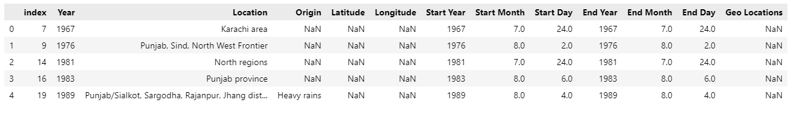
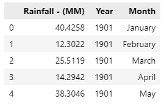

## Data Vsiaulaization with Pandas


In this tutorial, we will perform data manipulation on our datasets to prepare it for machine learning. 

### Essential Libaries
Firstly, let us import the following libaries into our Jupyter Notebook:
- Pandas: Library for Data Manipulation and Analysis in Python 
- NumPy: Libarary for Scientific Computation in Python
```
# Basic Libaries
import pandas as pd 
import numpy as np
```
### Import CSV file
Next, we will import CSV files which contains the data that we are interested in.

In this tutorial, we will use 2 relevant dataset that can be found via Kaggle:
1. [Natural Disaster data from 1900 to 2021](https://www.kaggle.com/code/gianlab/storm-and-flood-forecast/data)
2. [Rainfall data for Pakistan from 1900 to 2016](https://www.kaggle.com/code/hyderghauri/eda-and-machinelearning-on-rainfall-pakistan/data)

As both of the datasets are in .csv format, we will use **read_csv** and store the data as dataframe into **disaster_data** and **rainfall_data** variables.
```
disaster_data = pd.read_csv('1900_2021_DISASTERS.xlsx - emdat data.csv') 
rainfall_data = pd.read_csv('Rainfall_1901_2016_PAK.csv') 
```
### Data Manipulation 
To show a preview of the dataframe, we can use the **.head()** to show the first 5 rows of the dataframe.
```
disaster_data.head()
```


As we are concern with the **Flood** as the disaster type and the country **Pakistan**. Let us filter the dataframe accordingly based on the conditions and stored it into a new variable.
```
# filter disaster data accourding to Disaster Type and Country 
flood_df = disaster_data[((disaster_data['Disaster Type'] == "Flood") & (disaster_data['Country'] == 'Pakistan'))].reset_index(drop=True) 
```
We can check if the new dataframe contains only data from **Pakistan** only. 
```
# check the value counts
flood_df['Country'].value_counts()
```


We can then check the list of available columns. 
```
# check the columns
flood_df.columns
```


Looking at the columns, we can drop the columns that are not useful in our machine learning. 
```
# drop all the unnecessary columns theat will not be used
flood_df = flood_df.drop(columns=['Seq', 'ISO', 'Region', 'Glide', 'Disaster Group', 'Disaster Subgroup', 'Disaster Subtype', 'Disaster Subsubtype', 'Event Name', 'Adm Level', 
'Admin1 Code', 'Admin2 Code', 'Continent', 'Associated Dis', 'Associated Dis2', 'Local Time', 'OFDA Response', 'Appeal', 'Declaration', 'Aid Contribution', 'Disaster Type', 'Country', 
'Dis Mag Value', 'Dis Mag Scale', 'River Basin', 'Total Deaths', 'No Injured', 'No Affected', 'No Homeless','Total Affected', 'Insured Damages (\'000 US$)','Total Damages (\'000 US$)', 'CPI'])
```
We can then verify the remaining columns left. 
```
# check the columns
flood_df.columns
```


Next, let us check if there is any null values in our dataframe. 
```
# Check out the null values in the dataframe
flood_df.isnull().sum()
```


We can see that there are some null values in our dataframe. You can choose to either fill the null values or drop the null values.

In our case, we will drop the null values for the following columns:
- Start Month
- Start Day
- End Day
```
# drop the null record 
flood_df = flood_df.dropna(axis=0, subset=['Start Month'])
flood_df = flood_df.dropna(axis=0, subset=['Start Day'])
flood_df = flood_df.dropna(axis=0, subset=['End Day'])
```
We can use the same command again to check if there is still null values for the above columns.
```
# Check out the null values in the dataframe
flood_df.isnull().sum()
```


Now, let us have a preview of our dataframes. 
```
flood_df.isnull().sum()
```

```
rainfall_df.isnull().sum()
```


Through the preview of the dataframes, we can see that the rainfall dataframe provides rainfall data in terms of month. However, the flood dataframe provides the data based on the occurrence of each natural disaster. Thus, we can manipulate the dataframe in order for it to suit the rainfall data. One way is to duplicate the record if it last more than one month.

```
# repeating the values
more_than_one_month = flood_df['Start Month'] != flood_df['End Month']
df1 = flood_df[more_than_one_month].copy()
df1 = df1.loc[df1.index.repeat(df1['End Month'] - df1['Start Month'] + 1)]

# set the start day to 1 
df1.loc[df1.duplicated(['Start Year', 'Start Month', 'Start Day', 'Location'], keep='first'), 'Start Day'] = 1

# set end day to last day. end month to same as start month 
df1.loc[df1.duplicated(['End Year', 'End Month', 'End Day', 'Location'], keep='last'), 'End Day'] = 31

# assigning  increasing values to each group
df1['Start Month'] += df1[['Start Month', 'Start Year', 'End Year', 'End Month', 'Location']].astype(str).groupby(['Start Month', 'Start Year', 'End Year', 'End Month', 'Location']).cumcount()

# end month 
df1['End Month'] = df1['Start Month']

# # generating output 
flood_df = pd.concat([df1, flood_df[~more_than_one_month]]).sort_index(kind = 'mergesort').reset_index(drop=True)
```
Now, let us have a preview of the first 10 rows.
```
flood_df.head(10)
```


We can see that from the dataframe that if a flood occurs more than one month, a duplicate record will appear. 

Next, let us duplicate **'Start Month'** and rename it to **'Month'** so that we can join with the rainfall dataframe. 
```
# column_to_move = flood_df.pop("Start Month")
column_to_move = flood_df['Start Month'].copy()

# insert column with insert(location, column name, column value)
flood_df.insert(1, "Month", column_to_move)
```
Let us have a preview of the dataframe. 
```
flood_df.head()
```


Based on the preview of the 2 dataframes just now, we can notice that in rainfall dataframe, the month is displayed in name instead of integer. 

Thus, let us transform the month in flood dataframe to name. To achieve this, we need to make use of the **calendar** library in Python. Let us import the library. 
```
import calendar
```
Then, making use of the **calendar** library, let us transform it into name. 
```
flood_df = flood_df.astype({'Month': 'int32'})
flood_df = flood_df.astype({'Start Month': 'int32'})
flood_df = flood_df.astype({'End Month': 'int32'})

flood_df['Month'] = flood_df['Month'].apply(lambda x: calendar.month_name[x])
flood_df['Start Month'] = flood_df['Start Month'].apply(lambda x: calendar.month_name[x])
flood_df['End Month'] = flood_df['End Month'].apply(lambda x: calendar.month_name[x])
```
Then, let us have a preview of the dataframe to confirm the changes. 
```
flood_df.head()
```


Now, we can merge the two dataframe together. There are different types of merge available in pandas simimlar to SQL JOIN such as the following:
- left: JOIN based on the keys from the left dataframe
- right: JOIN based on the keys from the right dataframe
- outer: JOIN using keys from both dataframes
- inner: JOIN only keys that are available from both dataframes
- cross: JOIN based on the cartesian product from both dataframes

*For more information, please kindly view the information [here](https://pandas.pydata.org/docs/reference/api/pandas.DataFrame.merge.html)*

In our case, we will use the left merge so that we wil have all the rainfall datas. In those months where flood will happen, it will contains relevant flood data. In addition, we will create a column called "Flood" to indicate whether that particular month has flood or not. 

```
# Create a new column called "Flood" and set value aas "Yes"
flood_df['Flood'] = 'Yes'

# Create a new variable that merge both datasets 
merged_data = pd.merge(rainfall_data, flood_df, on=['Year', 'Month'], how='left')
# Fill null values in column "Flood" with "No" 
merged_data['Flood'] = merged_data['Flood'].fillna(value='No')
```

Then we can have a preview of the new merged data
```
merged_data.head()
```


Kudos, you made it! :star2:

This is the end of this tutorial. Please kindly move on to the next tutorial [here](https://github.com/AroojArif12143/SILP/tree/main/BlogPost3)
