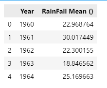

## Annual Rainfall Data Visualization in Python
You will find the dataset for mean annual rainfall as Dataset.csv
The Jupyter Notebook is attached for code reference.
 


For this tutorial, we will be perform data visualisation regarding anuual rainfall in Pakistan :cloud_with_rain:. 

Let us import the necessay libraries for this tutorial. 
```
import numpy as np #123
import matplotlib.pyplot as plt
import pandas as pd
import seaborn as sns
```

:cloud_with_rain:Next, let us read the spreadsheet file of our dataset and store it in a panda dataframe.


```
df = pd.read_csv('Dataset.csv')
df.head()
```


:cloud_with_rain:Next, let us plot a bar chart to show the annual rainfall in Pakistan.
```
x_train = list(df.iloc[:, 0])
y_train = list(df.iloc[:, 1])
  

plt.bar(x_train, y_train, color='g')
plt.title("Annual Rainfall")
plt.xlabel("Years")
plt.ylabel("RainFall Mean()")
  
plt.show()
```


:cloud_with_rain:Next, let us plot a scatter plot to show the mean annual rainfall in Pakistan.
You can plot these two points using the `scatter()` function in the `matplotlib` library, as shown in the cell below. 
- The function arguments `marker` and `c` show the points as red crosses (the default is blue dots).

You can use other functions in the `matplotlib` library to set the title and labels to display.
```
# Plot the data points
plt.scatter( x_train, y_train, marker='x', c='r') #exchange x_train location with y_train here to get flipped axis
# Set the title
plt.title("RainFall Mean()")
# Set the y-axis label
plt.ylabel('Year')
# Set the x-axis label
plt.xlabel('Year')
plt.show()
```


Kudos, you made it to the end of the tutorial! :star2:
 
 
