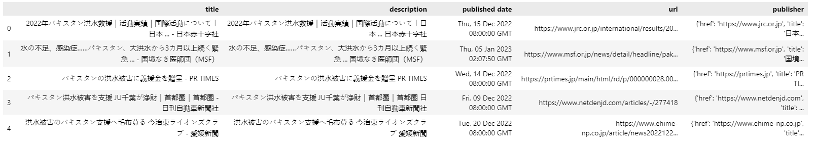

# Web Scraping about Flood in Pakistan 


In this tutorial, we will be learning how to perform **web scraping** via Python to gather news about Flood in Pakistan easily. **Web Scraping** is the procedure gathering and converting raw data on the internet. Web scraping is a good alternative to assist us in collecting the required data easily if we are unable to find readily available data online. 

Firstly, let us pip install gnews if it is not installed by running the below command. Gnews is a python package that allow us to search article on Google News and return with a JSON response. 
```
!pip install gnews
```
After installing the gnews package, we can import the necessary libraries.
```
# import libraries 
import pandas as pd 
from gnews import GNews
```
After importing the gnews package, let us create the Google News API with the parameters. In our tutorial, we set the language and country as *jp*. You can also set other language and country that are supported.
```
# create the Google News API with parameters 
google_news = GNews(language='jp', country='JP')
```
Then, we can create the search by calling **.get_news** with the search parameter that we are looking to find. In this example, we will be searching for **パキスタン洪水** *(which is Pakistan Flood in japanese)* and store it in the *flood* variable.
```
# let's create the search 
flood = google_news.get_news('パキスタン洪水')
```
Let us take a look at the title for the news that we search. 
```
# Lets loop through the actual titles 
for i in flood:
  print(i['title'])
```


For ease of handling the data, let us convert it to dataframe by using Pandas. After converting it to dataframe, let us have a preview of what data we have. 
```
# Convert the JSON into dataframe 
data = pd.DataFrame(flood)
data.head()
```

Next, let us pip install **textblob** if it is not installed by running the below command. textblob is a python package that process text data to perform common Natural Language Processing (NLP) tasks like translation, sentiment analysis. 
```
!pip install textblob
```
After installing the textblob package, we can import the library.
```
from textblob import TextBlob
```
Next, Let us create two functions to perform the following by making use of the textblob libraries:
- translate the headlines from japanese to english 
- perform sentimental analysis on the headlines
```
# let's create a function that bring back sentiment and translateions
def translation(text):
  blob = TextBlob(text)
  return str(blob.translate(from_lang='ja', to='en'))
  
def sentiment(text):
  blob = TextBlob(text)
  return blob.sentiment.polarity

# provide translation and sentiment analysis on our data
data['translation'] = data['title'].apply(translation)
data['sentiment'] = data['translation'].apply(sentiment)
```
Then, let us have a preview of the data. 
```
data.head()
```


Next, let us create a new column "Sentiment Class" to state whether the sentiment of the headline is neutral, positive or negative based on the sentiment value.
```
# lets create an actual class 
import numpy as np

data['Sentiment Class']  = np.where(data['sentiment']<0,"negative", np.where(data['sentiment']>0,"positive","neutral"))
```

Then, let us have a preview of the data. 
```
data.head()
```


We can check the percentage of the sentiment class of all the headlines in the dataframe.
```
data['Sentiment Class'].value_counts(normalize=True)
```


Then, let us sort our dataframe according to the dates in descending order. 
```
# Convert DateTime to Date
data['Date'] = pd.to_datetime(data['published date'])
data['Date'] = data['Date'].dt.date

# sort according to date in descending order
data = data.sort_values(by='Date', ascending=False).reset_index(drop=True)
```

We can then preview our dataframe to ensure that it is sorted to what we want. 
```
data.head()
```


Lastly, let us export our dataframe to csv file.
```
data.to_csv('scraper.csv')
```
Kudos, you made it to the end of the tutorial. Well Done!:star2:

