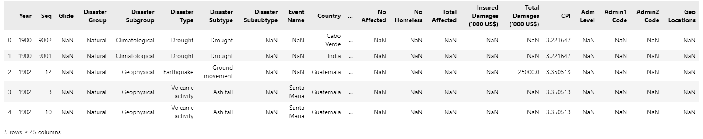

## Data manipulation with Pandas
In this tutorial, we will perform data manipulation on our datasets to prepare it for machine learning. 

### Essential Libaries
Firstly, let us import the following libaries into our Jupyter Notebook:
- Pandas: Library for Data Manipulation and Analysis in Python 
- NumPy: Libarary for Scientific Computation in Python
```
# Basic Libaries
import pandas as pd 
import numpy as np
```
### Import CSV file
Next, we will import CSV files which contains the data that we are interested in.

In this tutorial, we will use 2 relevant dataset that can be found via Kaggle:
1. [Natural Disaster data from 1900 to 2021](https://www.kaggle.com/code/gianlab/storm-and-flood-forecast/data)
2. [Rainfall data for Pakistan from 1900 to 2016](https://www.kaggle.com/code/hyderghauri/eda-and-machinelearning-on-rainfall-pakistan/data)

As both of the datasets are in .csv format, we will use **read_csv** and store the data as dataframe into **disaster_data** and **rainfall_data** variables.
```
disaster_data = pd.read_csv('1900_2021_DISASTERS.xlsx - emdat data.csv') 
rainfall_data = pd.read_csv('Rainfall_1901_2016_PAK.csv') 
```
### Data Manipulation 
To show a preview of the dataframe, we can use the **.head()** to show the first 5 rows of the dataframe.
```
disaster_data.head()
```


As we are concern with the **Flood** as the disaster type and the country **Pakistan**. Let us filter the dataframe accordingly based on the conditions and stored it into a new variable.
```
# filter disaster data accourding to Disaster Type and Country 
flood_df = disaster_data[((disaster_data['Disaster Type'] == "Flood") & (disaster_data['Country'] == 'Pakistan'))].reset_index(drop=True) 
```
We can check if the new dataframe contains only data from **Pakistan** only. 
```
# check the value counts
flood_df['Country'].value_counts()
```


We can then check the list of available columns. 
```
# check the columns
flood_df.columns
```


Looking at the columns, we can drop the columns that are not useful in our machine learning. 
```
# drop all the unnecessary columns theat will not be used
flood_df = flood_df.drop(columns=['Seq', 'ISO', 'Region', 'Glide', 'Disaster Group', 'Disaster Subgroup', 'Disaster Subtype', 'Disaster Subsubtype', 'Event Name', 'Adm Level', 
'Admin1 Code', 'Admin2 Code', 'Continent', 'Associated Dis', 'Associated Dis2', 'Local Time', 'OFDA Response', 'Appeal', 'Declaration', 'Aid Contribution', 'Disaster Type', 'Country', 
'Dis Mag Value', 'Dis Mag Scale', 'River Basin', 'Total Deaths', 'No Injured', 'No Affected', 'No Homeless','Total Affected', 'Insured Damages (\'000 US$)','Total Damages (\'000 US$)', 'CPI'])
```
We can then verify the remaining columns left. 
```
# check the columns
flood_df.columns
```

